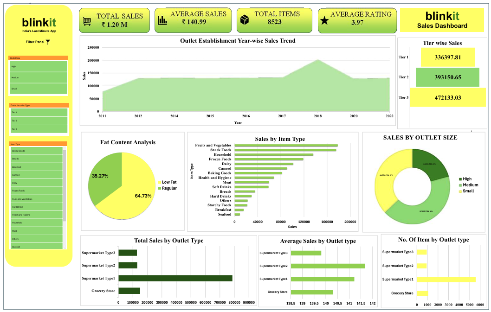

📊 Blinkit Sales Dashboard Analysis

An interactive sales analytics dashboard built in **Microsoft Excel** to analyze Blinkit's retail sales performance using Pivot Tables, Pivot Charts, KPI cards, and slicers. The dashboard enables dynamic filtering and provides business insights into sales trends, product performance, and outlet analysis.

 📌 Project Overview

This project focuses on transforming raw Blinkit sales data into an interactive dashboard for business reporting. The dashboard provides key performance indicators (KPIs), sales trends, and category-wise analysis to support data-driven decision-making.

 🛠️ Tools & Technologies

- Microsoft Excel
- Pivot Tables
- Pivot Charts
- Slicers
- Conditional Formatting
- Data Cleaning

 📈 Key Features

- Calculated important KPIs including:
  - Total Sales
  - Average Sales
  - Total Items Sold
  - Average Customer Rating

- Designed an interactive dashboard using:
  - Pivot Tables
  - Pivot Charts
  - Dynamic Slicers

- Enabled interactive filtering based on:
  - Outlet Size
  - Outlet Location Type
  - Item Type

- Visualized business metrics such as:
  - Outlet Establishment Year-wise Sales Trend
  - Sales by Item Type
  - Sales by Outlet Size
  - Fat Content Analysis
  - Total Sales by Outlet Type
  - Average Sales by Outlet Type
  - Number of Items by Outlet Type
  - Tier-wise Sales

 📊 Dashboard Preview

💡 Business Insights

- Identified top-performing outlet tiers and outlet sizes.
- Compared sales across different product categories.
- Analyzed yearly sales trends to understand business growth.
- Evaluated customer preferences through fat-content and item-type analysis.
- Generated KPI-based insights to support business reporting and performance monitoring.

 📂 Repository Structure

Blinkit-Sales-Dashboard-Analysis/
│
├── Blinkit Project Dashboard.xlsx
├── dashboard.png
└── README.md

Skills Demonstrated

- Data Cleaning
- Data Analysis
- KPI Reporting
- Dashboard Development
- Data Visualization
- Business Intelligence
- Microsoft Excel

